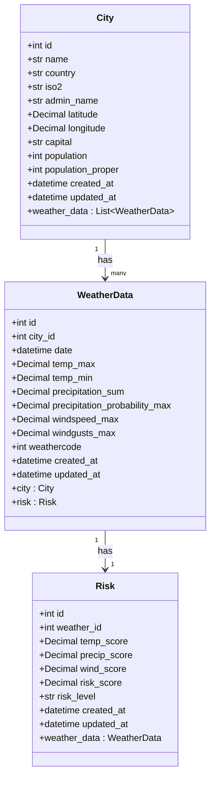

# MeteoRisk — Data Model (UML / ER Diagram)

This diagram renders automatically on GitHub. It can also be pasted into [mermaid.live](https://mermaid.live) to export as PNG/SVG.

## Class Diagram (SQLAlchemy ORM)

## Notes

- `weather_data.(city_id, date)` has a **UNIQUE constraint** to prevent duplicate forecasts when the pipeline re-runs and updates an existing forecast for the same city/day instead.
- `risks.weather_id` is a 1-to-1 relationship with `weather_data` — each forecast row gets exactly one risk assessment.